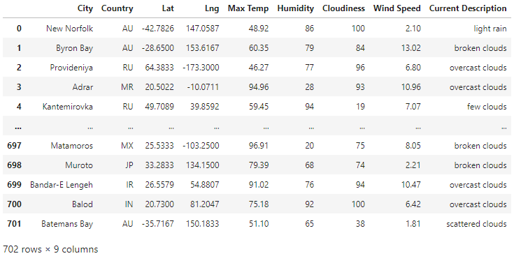
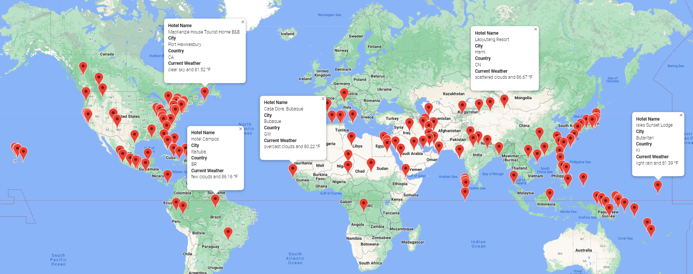
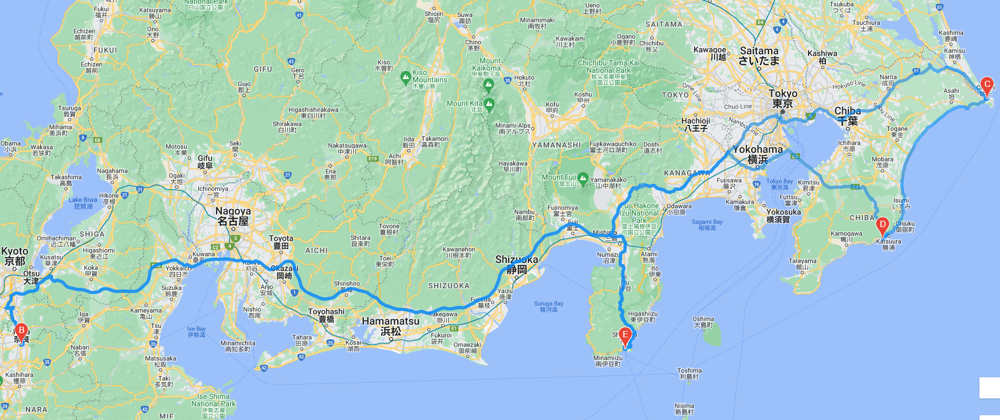
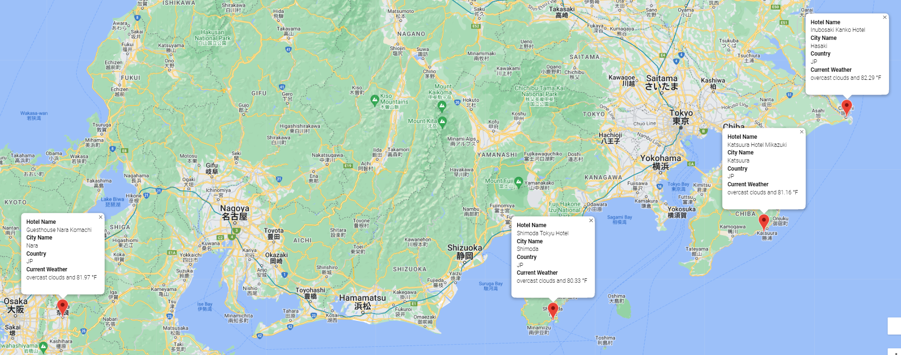

# World_Weather_Analysis
Use weather description data to enhance the PlanMyTrip app. Then, use input statements to filter the data for weather preferences, which will be used to identify potential travel destinations and nearby hotels. The app will then choose four cities from the list of potential travel destinations to create a travel itinerary. Finally, using the Google Maps Directions API, create a travel route between the four cities and a marker layer map.

## Retrieve Weather Data
[Link to Weather Database code](./Weather_Database/Weather_Database.ipynb)

Find cities closest to randomly generated coordinates and gather information on them using a Weather Map API call into a list. Then, convert the list of information into a dataframe. Then, save to WeatherPy_Database.csv file.

## Create a Customer Travel Destinations Map
[Link to Vacation Search code](./Vacation_Search/Vacation_Search.ipynb)

From WeatherPy_Database.csv file and input from the user on preferred maximum and minimum temperatures, locate the cities that correspond to the user input and hotels in those cities. Then, save to WeatherPy_vacation.csv file and create a map with markers on the cities and pop-ups with the hotel name, city, country, current weather, and maximum temperature of the city. An example of a map with the user input for the minimum preferred temperature being 80 degrees Fahrenheit and the maximum preferred temperature being 95 degrees Fahrenheit is shown below.

## Create a Travel Itinerary Map
[Link to Vacation Itinerary code](./Vacation_Itinerary/Vacation_Itinerary.ipynb)
From the WeatherPy_vacation.csv file, select 4 cities and create a travel itinerary route between the 4 cities by creating dataframes for each city, then creating a direction layer to map the route between the start point, the waypoints, and the stop point. An example of the map for the route being from Shimoda, JP to Nara, JP to Hasaki, JP to Katsuura, JP and back to Shimoda, JP is shown below.

From the 4 cities selected, create a map with markers on the 4 cities and info boxes with the hotel name, city, country, current weather, and maximum temperature of the city. An example for the 4 cities chosen as Shimoda, JP, Nara, JP, Hasaki, JP, and Katsuura, JP is shown below.

